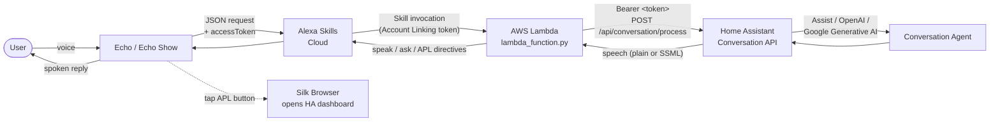
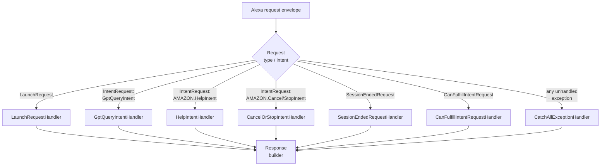

# Architecture & Internals

How [`lambda_functions/lambda_function.py`](../../lambda_functions/lambda_function.py) works, end to end.
Diagrams use Mermaid (rendered natively on GitHub).

---

## 1. High-level system



Two side flows worth calling out:

- **Pre-set prompt path (`fetch_prompt_from_ha`)** — on `LaunchRequest`, the Lambda reads the state of an `input_text.*` helper in HA. If non-empty (and not the literal `"none"`), that text is processed as if the user had spoken it. Lets HA push a question into Alexa.
- **Dashboard path (`open_page`)** — for Echo Show devices, the Lambda renders an APL document with a button. Tapping it issues `OpenUrlCommand` so Silk opens `<home_assistant_url>/<dashboard>[?kiosk]`.

---

## 2. File layout

```
HomeAssistantAssistAWS/
├── lambda_functions/
│   ├── lambda_function.py        # the entire skill handler
│   ├── requirements.txt          # ask-sdk-core, requests
│   ├── apl_openha.json           # APL doc: welcome screen + "Open HA" button
│   ├── apl_empty.json            # APL doc rendered before issuing OpenUrlCommand
│   └── locale/                   # one *.lang file per Alexa locale
│       ├── en-US.lang
│       ├── pt-BR.lang
│       └── ... (16 more)
├── doc/
│   ├── interactionModels.json    # Alexa interaction model (intents + slots)
│   └── en/INSTALLATION.md, UPDATE.md
├── .github/workflows/release.yml # auto-zip on push to main, publish GH Release
├── README.md
└── release_notes.md
```

A `.lang` file is a flat `key=value` text file whose values may contain `;`-separated phrase variants. `pick_random_phrase()` chooses one at speak time so Alexa doesn't sound robotic.

---

## 3. Module-level state (cold start)

When the Lambda container cold-starts, the module body executes once:

```mermaid
flowchart TB
    A[Module import] --> B[load_config &#40;'locale/en-US.lang'&#41;]
    B --> C["Inject every key=value pair<br/>into Python <code>globals&#40;&#41;</code>"]
    C --> D[Read env vars:<br/>home_assistant_url<br/>assist_input_entity<br/>home_assistant_agent_id<br/>flags &#40;debug, kioskmode, ...&#41;]
    D --> E["Init module globals:<br/>conversation_id = None<br/>last_interaction_date = None<br/>account_linking_token = None<br/>apl_document_token = uuid4&#40;&#41;"]
    E --> F[Build CustomSkillBuilder<br/>register handlers]
    F --> G["Export <code>lambda_handler</code>"]
```



> ⚠️ Important: **module globals persist across invocations on a warm container**. See `TODO.md` item #1 — `account_linking_token` and `conversation_id` being globals is a multi-user data-leak risk.

---

## 4. Handler dispatch

`CustomSkillBuilder` registers six handlers; on every Lambda invocation the SDK picks the first whose `can_handle` returns `True`.



- `CanFulfillIntentRequestHandler` lets Alexa Name-Free Interaction route a stray utterance to this skill if it looks like a `GptQueryIntent`.
- `CatchAllExceptionHandler` blanket-catches and returns a localized error phrase — keeps the skill from going silent on uncaught bugs.

---

## 5. LaunchRequest flow

What happens when the user says *"Alexa, open home smart"*.

```mermaid
sequenceDiagram
    autonumber
    participant Alexa
    participant L as LaunchRequestHandler
    participant Cfg as load_config
    participant HA as Home Assistant
    participant APL as APL renderer

    Alexa->>L: LaunchRequest envelope
    L->>Cfg: localize&#40;&#41; → load locale/&lt;loc&gt;.lang
    L->>L: Read context.system.user.access_token<br/>→ account_linking_token (global)
    alt token missing
        L-->>Alexa: speak("alexa_speak_error")
    end
    L->>HA: GET /api/states/&lt;assist_input_entity&gt;<br/>(Bearer token, timeout=5)
    HA-->>L: {"state": "..."}
    alt state non-empty and != "none"
        L->>L: process_conversation&#40;state&#41;
        L-->>Alexa: speak(reply) + ask(question)
    else no pre-set prompt
        L->>APL: device.supported_interfaces.alexa_presentation_apl?
        opt APL supported
            L->>APL: RenderDocumentDirective(apl_openha.json)
        end
        L->>L: choose welcome vs next-message phrase<br/>based on last_interaction_date
        alt suppress_greeting=true
            L-->>Alexa: ask("")
        else
            L-->>Alexa: speak(welcome) + ask(welcome)
        end
    end
```

Two of these globals are state-leak hazards across users in a warm container:
- `account_linking_token` (set step 3, used by step 5 and later by `process_conversation`)
- `last_interaction_date` (read & written in the no-prompt branch).

---

## 6. GptQueryIntent — the main path

```mermaid
sequenceDiagram
    autonumber
    participant Alexa
    participant H as GptQueryIntentHandler
    participant K as keywords_exec
    participant APL as APL renderer
    participant Async as run_async_in_executor
    participant Conv as process_conversation
    participant HA as Home Assistant

    Alexa->>H: IntentRequest GptQueryIntent<br/>(slot: query)
    H->>H: localize&#40;&#41;
    H->>H: account_linking_token = context...access_token
    H->>K: keywords_exec(query, handler_input)
    alt query matches "open dashboard"
        K->>APL: open_page&#40;&#41; (RenderDocument + ExecuteCommands OpenUrl)
        K-->>Alexa: speak("Opening Home Assistant")
    else query is short close keyword
        K->>K: delegate to CancelOrStopIntentHandler
        K-->>Alexa: speak(exit phrase) + endSession
    else
        K-->>H: None
        opt home_assistant_room_recognition=true
            H->>H: append ". device_id: &lt;id&gt;" to query
        end
        opt enable_acknowledgment_sound=true
            H->>Alexa: progressive SpeakDirective<br/>("alexa_speak_processing")
        end
        H->>Async: run process_conversation(full_query)
        Async->>Conv: invoke
        Conv->>HA: POST /api/conversation/process<br/>{text, [language], [agent_id], [conversation_id]}
        HA-->>Conv: JSON response
        Conv->>Conv: extract_speech (prefer SSML)<br/>strip "device_id: ..."<br/>improve_response (decimals, sanitize)
        Conv-->>Async: speech string
        Async-->>H: speech string
        alt ask_for_further_commands=true
            H-->>Alexa: speak(reply) + ask("Anything else?")
        else
            H-->>Alexa: speak(reply) + endSession
        end
    end
```

Notes:
- `extract_speech` prefers `response.speech.ssml.speech` over `.plain.speech`. SSML is returned to Alexa as-is; plain text goes through `improve_response` (newline collapsing, char allowlist, `de-DE` decimal-comma).
- The `device_id:` echo trim ([line 329](../../lambda_functions/lambda_function.py)) handles HA's room-recognition feature returning the device_id verbatim in the speech.
- `run_async_in_executor` is **not** real async — it spins a fresh event loop to wrap a sync `requests` call. See `TODO.md` #12.

---

## 7. Localization & config loading

```mermaid
flowchart LR
    Env([os.environ]) --> M[Module-level<br/>config vars]
    F1[locale/en-US.lang] -- "load_config&#40;&#41;<br/>at import" --> G[Python globals&#40;&#41;]
    F2[locale/&lt;user-locale&gt;.lang] -- "load_config&#40;&#41;<br/>per request via localize&#40;&#41;" --> G
    G --> P[pick_random_phrase &amp;<br/>globals&#40;&#41;.get&#40;'...'&#41; lookups]
    M --> Conv[process_conversation]
    M --> URL[get_hadash_url]
    P --> Speak[Response builder<br/>speak/ask]
```



> ⚠️ Loading directly into `globals()` means **any key in a `.lang` file overwrites the matching module global** — e.g. a stray `home_assistant_url=` line in a locale file would silently replace the configured URL. See `TODO.md` #2.

---

## 8. Response shaping

`improve_response` runs only on **plain text** speech (SSML is passed through):

| Step | Transformation | Rationale |
| --- | --- | --- |
| `:\n\n` → `''` | strip header-style colons + double newline | Markdown-style replies from LLMs |
| `\n\n` → `'. '` | paragraph break → sentence | Alexa can't pause on newlines |
| `\n` → `','` | line → soft pause | better TTS pacing |
| `-`, `_` → `' '` | strip dashes/underscores | LLM-generated identifier-like text |
| Regex `(\d+)\.(\d{1,3})` → `\1,\2` (only `de-DE`) | `2.4` → `2,4` | German decimal comma |
| Char allowlist `[^A-Za-z0-9 …]` | drop everything else | avoid Alexa choking on emoji/symbols |

`replace_words` is a separate hook that pre-rewrites known mis-transcriptions before sending the query to HA (currently just `4.º → quarto` for Portuguese ordinals).

---

## 9. APL "Open HA" path

For Echo Show / Echo Spot devices (`alexa_presentation_apl` interface present):

```mermaid
sequenceDiagram
    autonumber
    participant U as User
    participant E as Echo Show
    participant L as Lambda
    participant Silk as Silk Browser
    participant HA as Home Assistant

    U->>E: "Alexa, open home smart"
    E->>L: LaunchRequest
    L-->>E: RenderDocumentDirective(apl_openha.json)<br/>+ speak(welcome)
    E->>U: shows welcome + button
    U->>E: tap "Open Home Assistant"
    Note over E: APL onPress fires<br/>OpenUrlCommand(source=ha_dashboard_url)
    E->>Silk: open URL
    Silk->>HA: GET /&lt;dashboard&gt;[?kiosk]
    HA-->>Silk: dashboard HTML
```

Voice path: a query containing any of the `keywords_to_open_dashboard` triggers `open_page()`, which **first renders `apl_empty.json`** (an Amazon quirk — `OpenUrlCommand` requires a rendered document) **then issues `ExecuteCommandsDirective` with `OpenUrlCommand`**.

`get_hadash_url()` builds the URL by concatenation:
```
<home_assistant_url> + "/" + os.environ["home_assistant_dashboard"] + ("?kiosk" if kioskmode else "")
```

---

## 10. Environment variables (Lambda config)

| Variable | Required | Default | Effect |
| --- | --- | --- | --- |
| `home_assistant_url` | yes | — | Base URL of the HA instance (trailing `/` stripped). Bearer-auth target. |
| `assist_input_entity` | no | `input_text.assistant_input` | Entity polled on `LaunchRequest` for a pre-set prompt. |
| `home_assistant_agent_id` | no | — | Forwarded as `agent_id` to `/api/conversation/process` (pick a non-default Assist agent / OpenAI / Gemini). |
| `home_assistant_language` | no | — | Forwarded as `language`. |
| `home_assistant_dashboard` | no | `lovelace` | Path appended for the APL "Open HA" button. |
| `home_assistant_room_recognition` | no | `False` | If `true`, appends `device_id: …` to the query. |
| `home_assistant_kioskmode` | no | `False` | If `true`, dashboard URL gets `?kiosk`. |
| `ask_for_further_commands` | no | `False` | Keeps session open with a follow-up prompt after each reply. |
| `suppress_greeting` | no | `False` | Skip the welcome on `LaunchRequest`. |
| `enable_acknowledgment_sound` | no | `False` | Send a progressive "one moment" SpeakDirective during slow LLM calls. |
| `home_assistant_token` | no | — | Debug-only fallback token if Account Linking is missing **AND** `debug=true`. ⚠️ See `TODO.md` #6. |
| `debug` | no | (off) | Verbose logging + the token fallback above. ⚠️ Truthiness bug — see `TODO.md` #6. |

---

## 11. Release pipeline

[`.github/workflows/release.yml`](../../.github/workflows/release.yml) on every push to `main`:

```mermaid
flowchart LR
    Push[push to main] --> C{Diff includes<br/>lambda_functions/?}
    C -- no --> Done([exit])
    C -- yes --> Inst["pip install -r requirements.txt -t ."]
    Inst --> V[Bump tag<br/>lambda_functions_v&lt;major&gt;.&lt;minor+1&gt;]
    V --> Z[zip lambda_functions/]
    Z --> R[create-release@v1<br/>upload-release-asset@v1]
    R --> Out([GitHub Release<br/>with .zip])
```

The zip is the artifact that gets uploaded to the AWS Lambda function (manually, per [INSTALLATION.md](INSTALLATION.md) / [UPDATE.md](UPDATE.md)).

⚠️ Both `actions/create-release@v1` and `actions/upload-release-asset@v1` are archived since 2021. See `TODO.md` #9.

---

## 12. Where to start when modifying

| Goal | Start at |
| --- | --- |
| Change what Alexa says | `lambda_functions/locale/<your-locale>.lang` |
| Add a new keyword command | `keywords_exec` ([:258](../../lambda_functions/lambda_function.py)) |
| Tweak the HA call payload | `process_conversation` ([:281](../../lambda_functions/lambda_function.py)) |
| Change SSML/plain-text handling | `extract_speech` ([:381](../../lambda_functions/lambda_function.py)) + `improve_response` ([:412](../../lambda_functions/lambda_function.py)) |
| Add a new intent | New `AbstractRequestHandler` subclass + `sb.add_request_handler(...)` |
| Change the "Open HA" UI | `apl_openha.json` + `load_template` ([:425](../../lambda_functions/lambda_function.py)) |
| Add a new env var / flag | Top of file ([:72-81](../../lambda_functions/lambda_function.py)) — and document in §10 above |
