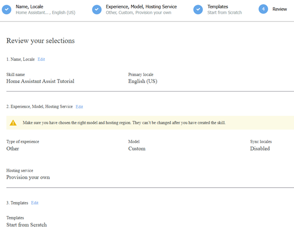
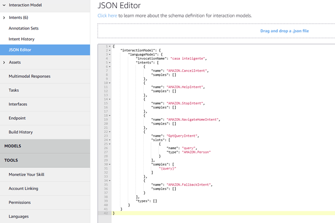
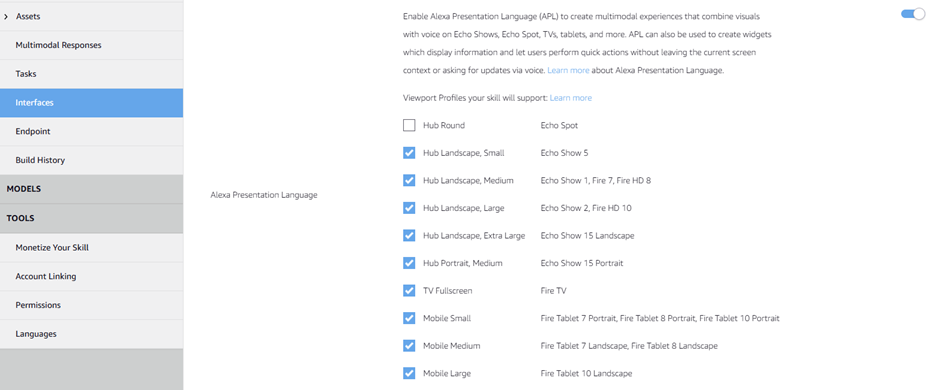
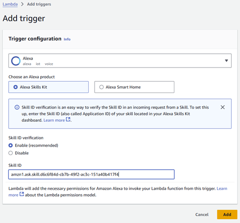
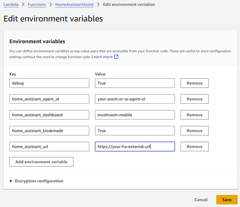
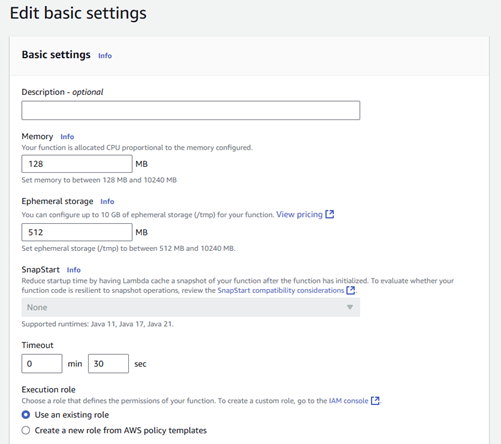
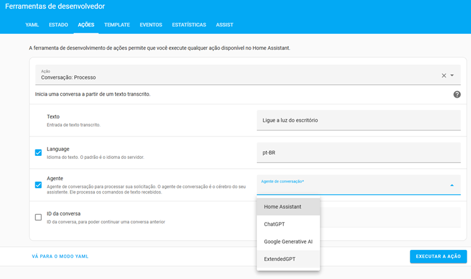

# INSTALAÇÃO

## Índice
1. [Requisitos](#requisitos)
2. [Criar uma Skill Amazon Alexa](#criar-uma-skill-amazon-alexa)
3. [Criar uma Função AWS Lambda](#criar-uma-função-aws-lambda)
4. [Adicionar Código à Função Lambda](#adicionar-código-à-função-lambda)
5. [Obtendo o home_assistant_agent_id](#obtendo-o-home_assistant_agent_id)
6. [Testar a Função Lambda](#testar-a-função-lambda)
7. [Configurar o Endpoint do Serviço da Skill](#configurar-o-endpoint-do-serviço-da-skill)
8. [Vinculação de Conta](#vinculação-de-conta)
9. [Ativando o reconhecimento de área](#ativando-o-reconhecimento-de-área)
10. [Habilitar a Skill no App Alexa](#habilitar-a-skill-no-app-alexa)
11. [Ativando iniciador de conversa com prompt do Home Assistant](#ativando-iniciador-de-conversa-com-prompt-do-home-assistant)
12. [Localização da Alexa](#localização-da-alexa)

---

## Requisitos
- Esta skill Alexa requer que sua instância do Home Assistant esteja acessível pela Internet via HTTPS na porta 443 usando um certificado SSL/TLS. Um certificado autoassinado não funcionará, mas um certificado confiável público ou um certificado assinado por uma autoridade certificadora aprovada pela Amazon deve funcionar.
- Uma conta de desenvolvedor da Amazon. Inscreva-se [aqui](https://developer.amazon.com/).
- Uma conta Amazon Web Services (AWS) é necessária para hospedar a função Lambda para sua skill Alexa Smart Home. O AWS Lambda é gratuito para até 1 milhão de solicitações e 1 GB de transferência de dados por mês.

## Criar uma Skill Amazon Alexa
- Faça login no [Alexa Developer Console](https://developer.amazon.com/alexa/console/ask). Você pode criar sua conta gratuita na página de login.
_Nota: Isso deve ser feito com a mesma conta Amazon que você usa nos seus dispositivos Alexa e app._
- Vá para a página `Alexa Skills`, se ainda não estiver lá, e clique no botão `Create Skill` para iniciar o processo.
- No passo `Name, Locale`: Insira o `Skill name` como preferir, depois selecione o `language` padrão da skill e clique em `Next`. _**Importante**: O idioma da sua skill deve ser o mesmo idioma da sua conta Amazon/Alexa. [Mais informações sobre idiomas suportados aqui](../../README.md#idiomas-suportados)_
- No passo `Experience, Model, Hosting service`: Selecione `Other` > `Custom` > `Provision your own`, depois clique em `Next`.
- No passo `Template`: Selecione `Start from Scratch` e clique em `Next`.
- Revise e clique em `Create Skill`.

  
- Isso pode levar alguns segundos, por favor, aguarde…
- Na próxima tela, você verá algumas opções, e no painel direito `Building your skill`, siga estes passos:

  

  - Clique em `Invocation Name >` altere o nome de invocação padrão conforme desejar, e depois clique em `Save`.
  - No menu de navegação à esquerda, vá para `CUSTOM` > `Interaction Model` > `JSON Editor`, arraste e solte o [arquivo interactionModels.json](../interactionModels.json), depois clique em `Save`.

  

  - Ainda no menu de navegação à esquerda, vá para `CUSTOM` > `Interfaces`, role para baixo até `Alexa Presentation Language`, habilite e desmarque `Hub Round` _(Esta skill não é compatível)_.

  

  - Agora, vá para `CUSTOM` > `Endpoint` e anote o `Your Skill ID`.
- Você criou a estrutura da skill. No próximo passo, faremos algum trabalho de desenvolvedor, mas mantenha o `Alexa Developer Console` aberto, pois precisaremos alterar a configuração da skill mais tarde.

## Criar uma Função AWS Lambda
Escreveremos um pequeno código hospedado como uma `função AWS Lambda` que redirecionará as solicitações da skill Alexa para sua instância do Home Assistant. Certifique-se de que você tem a API habilitada no Home Assistant, pois ela processará a solicitação e enviará a resposta. A função Lambda então entregará a resposta de volta para a skill Alexa.

Primeiro, você precisa fazer login no [console AWS](https://aws.amazon.com/console/). Se você ainda não tem uma conta AWS, pode criar um novo usuário com o benefício de 12 meses de uso gratuito. Você não precisa se preocupar com custos, mesmo que sua conta já tenha passado dos primeiros 12 meses, já que a AWS oferece até 1 milhão de solicitações Lambda, 1 GB de dados de saída e todos os dados de entrada gratuitamente todos os meses para todos os usuários. Veja mais detalhes sobre [preços do Lambda](https://aws.amazon.com/lambda/pricing/).

## Adicionar Código à Função Lambda
Agora você precisa criar uma função Lambda.
- Clique em `Services` na barra de navegação superior, expanda o menu para exibir todos os serviços AWS, depois, na seção `Compute`, clique em `Lambda` para navegar até o console Lambda ou use o campo de busca _(Dica: Adicione `Lambda` aos favoritos)_.
- **IMPORTANTE** - Skills Alexa só são suportadas em certas regiões da AWS. A localização do seu servidor atual será exibida no canto superior direito (por exemplo, Ohio). Selecione um servidor disponível abaixo que esteja mais próximo da sua localização e na sua região, com base no país da sua conta Amazon. Funções Alexa Lambda criadas em outros servidores não funcionarão corretamente e podem impedir a vinculação de contas!
  - **US East (N. Virginia)** região para Américas: skills em `English (US)`, `English (CA)`, `Portuguese (BR)`.
  - **EU (Ireland)** região para skills em `English (UK)`, `Italian`, `German (DE)`, `Spanish (ES)`, `French (FR)`.
  - **US West (Oregon)** região para skills em `Japanese` e `English (AU)` _(não testado ainda)_.
- Clique em `Functions` na barra de navegação à esquerda para exibir a lista de suas funções Lambda.
- Clique em `Create function`:
  - Selecione `Author from scratch`, depois insira um nome para a função como `HomeAssistantAssist`.
  - Selecione **Python 3.12** como Runtime e **x86_64** como arquitetura.
  - Não altere a `default execution role`, deixe como padrão `Create a new role with basic Lambda permissions`.
- Clique em `Create function`, depois configure os detalhes da função Lambda.

  

- Expanda a seção `Function overview` (se ela não estiver expandida), depois clique em `+ Add trigger` na parte esquerda do painel, depois selecione `Alexa` na lista suspensa para adicionar um gatilho Alexa à sua função Lambda.

  

- Selecione `Alexa Skills Kit` e insira o `Skill ID` da skill que você criou no passo anterior. _(Dica: Você pode precisar voltar ao `Alexa Developer Console` para copiar o `Skill ID`)._, depois clique no botão `Add`.

  

- Agora role até a aba `Code` > `Code source`, depois clique no botão `Upload from` à direita e selecione `zip file`.
  - Faça upload do arquivo `lambda_function_v*.zip` baixado dos [últimos lançamentos](https://github.com/fabianosan/HomeAssistantAssistAWS/releases).
  - Todo o código será substituído pelo arquivo enviado, e você não poderá editá-lo _(Se quiser editar algum arquivo, faça isso em sua estação antes deste passo)_.
- Clique no botão `Deploy` para publicar o código atualizado.
- Navegue até a aba `Configuration`, selecione `Environment variables` no menu de navegação à esquerda. Você precisa adicionar `pelo menos uma variável de ambiente` da lista abaixo. As variáveis restantes são `opcionais`, mas configuram recursos específicos no funcionamento da skill. Para adicionar uma variável, clique no botão `Edit`, depois adicione as seguintes chaves e valores:

  
  - (obrigatório) Chave = **home_assistant_url**, Valor = A URL raiz do seu Home Assistant acessível pela Internet _(na porta 443)_. _Não inclua a barra `/` no final._
  - (opcional) Chave = **home_assistant_agent_id**, Valor = O Agent ID do seu Assist. [instruções aqui](#obtendo-o-home_assistant_agent_id)
  - (opcional) Chave = **home_assistant_language**, Valor = O idioma configurado no seu Assist. _(O padrão é o idioma configurado no Assist)_
  - (opcional) Chave = **home_assistant_room_recognition**: Ative o modo de identificação de área do dispositivo com `True`. **Atenção**, só funciona com IA, se utilizar o Assist padrão, desative essa opção, pois nenhum comando não irá funcionar (isso inclui a nova funcionalidade `Assist fallback` do HA 2024.12 que também não irá funcionar).
  - (opcional) Chave = **home_assistant_dashboard**, Valor = O ID do seu painel. Exemplo: `mushroom`. _(O padrão é 'lovelace') _
  - (opcional) Chave = **home_assistant_kioskmode**, Valor = `True`. Defina esta variável para habilitar o KIOSKMODE. _(Certifique-se de que você tenha este componente instalado, configurado e funcionando em sua instância do Home Assistant)._
  - (opcional) Chave = **ask_for_further_commands**, Valor = `True`. Esta variável determina se a Alexa perguntará por mais comandos após responder. Defina como `True` para ativar este comportamento ou `False` para desativá-lo. O padrão é `False`.
  - (opcional) Chave = **assist_input_entity**: Valor = `input_text.assistant_input`. Ative a funcionalidade de iniciar uma conversa com prompt do Home Assistant. **Atenção**, essa funcionalidade requer [configurações extras no Home Assistant](#ativando-iniciador-de-conversa-com-prompt-do-home-assistant).
  - (opcional) Chave = **ask_for_further_commands**, Valor = `True` ou `False`. Esta variável determina se a Alexa perguntará por mais comandos após responder. Defina como `True` para ativar este comportamento ou `False` para desativá-lo. O padrão é `False`.
  - (opcional) Chave = **suppress_greeting**, Valor = `True` ou `False`. Esta variável determina se a Alexa irá falar a saudação/pergunta inicial ao abrir a skill. Defina como `True` para desabilitar a saudação ou `False` para mantê-la. O padrão é `False`.
  - (opcional) Chave = **debug**, Valor = `True`. Defina esta variável para registrar as mensagens de depuração e permitir a variável de ambiente `home_assistant_token`.
  - (opcional, _não recomendado_) Chave = **home_assistant_token**, Valor = Seu Home Assistant Long-Lived Access Token. Você conectará sua skill Alexa à sua conta de usuário do Home Assistant nos próximos passos, então não precisará adicioná-lo aqui. No entanto, você pode adicioná-lo aqui para fins de depuração. _(Você deve remover e excluir essa variável de ambiente depois que a depuração terminar)_.
- Clique no botão **Save** no canto inferior direito.
- **Importante:** Se você estiver usando um modelo IA, ou a resposta da API do Home Assistant é `maior que 3 segundos` _(configuração padrão)_, você precisa aumentar o tempo limite da função Lambda, seguinido os passos abaixo:
  - Permaneça na aba `Configuração`, vá em `Configuração geral`, clique em `Editar` no canto direito do painel, agora edite as configurações básicas, no painel `Configurações básicas` e no campo `Tempo limite` você pode alterar para 30, 60 segundos ou o tempo que você precisar.
  - Clique em `Salvar` no canto inferior direito.

    

## Obtendo o `home_assistant_agent_id`:

- Com seu Home Assistant aberto, navegue até a **Ferramentas de Desenvolvedor**, vá na aba `Ações` e siga os passos abaixo: 
1. Busque por `conversation.process` no campo de ações e selecione:

  

2. Ative o campo `Agente` e selecione o agente de conversação desejado na lista:

  

3. Alterne para o `MODO YAML` e copie o ID que está no campo `agent_id`:

  

## Testar a Função Lambda
Agora que você criou a função Lambda, você vai fazer um teste básico.
- Navegue até a aba `Test`, depois selecione `Create new event`.
- Nomeie seu evento como preferir, por exemplo: `AssistTest`.
- Insira os seguintes dados na caixa de código chamada `Event JSON`:

```json
{
    "version": "1.0",
    "session": {
      "new": true,
      "sessionId": "SessionId.sample-session-id"
    },
    "context": {
      "System": {
        "application": {
          "applicationId": "amzn1.ask.skill.sample-application-id"
        },
        "user": {
          "userId": "amzn1.ask.account.sample-user-id",
          "accessToken": "sample-access-token"
        },
        "device": {
          "deviceId": "amzn1.ask.device.sample-device-id",
          "supportedInterfaces": {
            "Alexa.Presentation.APL": {}
          }
        }
      }
    },
    "request": {
      "type": "LaunchRequest",
      "requestId": "sample-request-id",
      "timestamp": "2024-10-18T00:00:00Z",
      "locale": "en-US"
    }
}
```

- Clique em `Save` no canto superior direito do painel.
- Faça login no Home Assistant e gere um `long-lived access token`. Depois de inserir seu long-lived access token na variável de ambiente `home_assistant_token` e definir a variável de ambiente `debug` para `True`, você pode executar o teste.
- Para testar, clique em `Test` no canto superior direito do painel.
- Se o teste correr bem e tudo estiver funcionando com sua função, o resultado aparecerá destacado em verde como `Executing function: succeeded`, o que significa que a skill foi iniciada corretamente.

  

## Configurar o Endpoint do Serviço da Skill
Agora, remova o `long-lived access token` _(se preferir, recomendado)_ das variáveis de ambiente e exclua-o do seu Home Assistant.
- Ainda no `AWS Console`, copie o `Function ARN` da sua função Lambda.
- Retorne ao `Alexa Developer Console` e vá para a página `Alexa Skills` _(se você ainda não estiver lá)_.
- Encontre a skill que você acabou de criar e clique no link `Edit` na lista suspensa `Actions`.
- Vá para `CUSTOM` > `Endpoint` na barra de navegação à esquerda da página `Build`.
- Cole o `Function ARN` copiado da sua função Lambda no campo `Default region` e clique no botão `Save` no canto superior direito.

  

## Vinculação de Conta
Alexa precisa vincular sua conta Amazon à sua conta do Home Assistant. Assim, o Home Assistant pode garantir que apenas solicitações autenticadas da Alexa possam acessar sua API.
Para vincular a conta, você precisa garantir que seu Home Assistant esteja acessível da Internet na porta 443.
- Retorne ao `Alexa Developer Console` e vá para a página `Alexa Skills` _(se você ainda não estiver lá)_.
- Encontre a skill que você acabou de criar e clique no link `Edit` na lista suspensa `Actions`.
- Clique em `ACCOUNT LINKING` na barra de navegação à esquerda da página `Build`.
- Marque o botão `Do you allow users to create an account or link to an existing account with you?`.
- Em `Settings`, desmarque a opção `Allow users to enable skill without account linking`.
- Role para baixo e certifique-se de que `Auth Code Grant` esteja selecionado.
- Insira todas as informações necessárias. Supondo que seu Home Assistant possa ser acessado por `https://[YOUR HOME ASSISTANT URL]`. Para a vinculação de conta Alexa, por padrão, a porta 443 é usada _(use seu firewall para redirecionar isso, se necessário)_:
  - **Your Web Authorization URI**: https://[YOUR HOME ASSISTANT URL]/auth/authorize
  - **Access Token URI**: https://[YOUR HOME ASSISTANT URL]/auth/token
  **Nota:** Embora seja possível atribuir uma porta diferente, a Alexa exige que você use a porta 443, então certifique-se de que seu firewall/proxy esteja redirecionando via porta 443. _(Leia mais na [documentação do desenvolvedor Alexa](https://developer.amazon.com/en-US/docs/alexa/smarthome/build-smart-home-skills-account-linking.html) sobre requisitos para vinculação de contas)_.
Apesar do aviso de isenção de responsabilidade da documentação da Alexa, os certificados `Let’s Encrypt` ainda são aceitos.
**Importante:** Você deve usar um `certificado SSL válido/confiável` para que a vinculação de contas funcione. Certificados autoassinados não funcionarão, mas você pode usar um certificado gratuito `Let’s Encrypt`.
  - **Your Client ID**:
    - https://pitangui.amazon.com/ se você estiver nas Américas.
    - https://layla.amazon.com/ se você estiver na Europa.
    - https://alexa.amazon.co.jp/ se você estiver no Japão ou Austrália _(não verificado ainda)_.

    **Importante:** A barra no final é importante _(não altere a URL acima)_.
  - **Your Secret**: Insira qualquer coisa que desejar; o Home Assistant não verifica este campo.
  - **Your Authentication Scheme**: Certifique-se de que selecionou `Credentials in request body`. _(O Home Assistant não suporta HTTP Basic)_.
  - Você pode deixar `Scope`, `Domain List` e `Default Access Token Expiration Time` em branco.
- Clique no botão `Save` no canto superior direito.
- Clique em `CUSTOM` na barra de navegação à esquerda da página `Build` e em `Build Skill` no canto superior direito.

  

## Ativando o reconhecimento de área
- **(SÓ FUNCIONA COM IA)** Nesse modo, a skill envia o device id (do dispositivo `echo` que está executando a skill) na chamada da API de conversação do Home Assistant, então com uma instrução de comando para a IA e um rótulo associado no dispositivo, a IA consegue identificador os dispositivo da mesma área onde está localizado sua `Alexa`, para ativar, siga os passos abaixo:

  ***Atenção !*** 
  ## Esse modo deixa os comandos mais lentos e e exige configurações mais complexas, além de não funcionar com o modo "Assist fallback" ativado que foi incluido na versão 2024.12 do HA:
  1. Altere a configuração `home_assistant_room_recognition` para `True` e faça um novo `deploy`;
  2. Ative o log de debug da API de conversação adicionando a seguinte configuração no `configuration.yaml` do Home Assistant:
  - Insira a seguinte informação:
     ```txt
     logger:
       logs:
         homeassistant.components.conversation: debug
     ```
  3. Reinicie o Home Assistant e inicie a skill pelo dispositivo echo desejado, depois de ativado, o log mostrará a instrução recebida pela skill conforme o exemplo abaixo:
    ```txt
    2024-10-10 11:04:56.798 DEBUG (MainThread) [homeassistant.components.conversation.agent_manager] Processing in pt-BR: ligue a luz da sala. device_id: amzn1.ask.device.AMAXXXXXX
     ```
     Você também pode obter o device_id no log "device: " pela ``AWS Developer Console`` > ```Monitor`` ``Cloud Watch logs`` se souber como fazê-lo.
  4. Pegue todo o identificador que estiver após o device_id, ex.: `amzn1.ask.device.AMAXXXXXX` e adicione um novo rótulo no **dispositivo echo** pela Integração `Alexa Media Player`:
  
    
    
  5. Atualize o **prompt de comando da IA** de sua preferência com a instrução abaixo ou tente uma instrução que a sua IA entenda:
     ```txt
     Se solicitado uma ação em um dispositivo e sua área não for fornecida, capture o identificador contido após o "device_id:" no comando, obtenha o rótulo com mesmo identificador e associe a área desse rótulo ao dispositivo para saber área o dispositivo pertence.
     ```

## Habilitar a Skill no App Alexa
- Você precisa usar o `Alexa Mobile App` para vincular sua conta.
  - No `app Alexa`, vá para `More` > `Skills & Games` > `Your Skills` -> `Dev`.
  - Clique na skill que você acabou de criar.
  - Clique em `Enable to use`.
  - Uma nova janela será aberta para direcioná-lo à tela de login do seu Home Assistant.
  - Depois de fazer login com sucesso, você será redirecionado de volta ao app Alexa.
  - Agora, você pode pedir à Alexa no seu dispositivo Echo ou no App Alexa para abrir a skill, como **Alexa, [seu Nome de Invocação]**.

## Ativando iniciador de conversa com prompt do Home Assistant

#### Esta configuração adiciona o recurso de prompter para permitir conversas da Alexa iniciadas a partir do Home Assistant

> ⚠️ **Antes de continuar**, garanta que você possui o [Alexa Media Player](https://github.com/alandtse/alexa_media_player) instalado e configurado.

1. Ative a configuração na skill da Alexa:
   - Verifique se a variável de ambiente `assist_input_entity` foi criada e configurada conforme abaixo no AWS Lambda:

     ```
     assist_input_entity = input_text.assistant_input
     ```

2. Crie um Auxiliar de Texto no Home Assistant:

    1. Abra o Home Assistant.
    2. Vá em: **Configurações → Dispositivos e Serviços → Auxiliares**
    3. Clique em **Criar Auxiliar** → Escolha **Texto**.
    4. Defina as seguintes opções:
        - **Nome:** `assistant_input`
        - **Número máximo de caracteres:** `255` (este é o limite de tamanho)
    5. Clique em **Criar**.

    > ⚠️ Nota: 255 caracteres é uma limitação rígida para o tamanho do prompt. Ainda não há uma solução confiável, exceto incorporar outras entradas de texto no prompt.

3. Crie um Script no Home Assistant:

    1. Vá até o [Console do Desenvolvedor Alexa](https://developer.amazon.com/alexa/console/ask).
    2. Na página inicial da sua skill, clique em **Copy Skill ID**.
    3. No Home Assistant, vá para **Configurações → Automatizações e Cenas → Scripts**.
    4. Clique em **Adicionar Script** e dê um nome como `Prompt Alexa Device`.
    5. Clique no menu de três pontos (⋮) e mude para o **Modo YAML**.
    6. Cole o seguinte YAML no editor.  
       Substitua os espaços reservados:
         - `*Sua Skill ID*` → Pelo ID real da sua skill Alexa  
         
         ```
         sequence:
          - action: input_text.set_value
            metadata: {}
            data:
              value: "{{prompt}}"
            target:
              entity_id: input_text.assistant_input
          - action: media_player.play_media
            data:
              media_content_id: *Sua Skill ID*
              media_content_type: skill
            target:
              entity_id: "{{alexa_device}}"
          - delay:
              hours: 0
              minutes: 0
              seconds: 10
              milliseconds: 0
          - action: input_text.set_value
            metadata: {}
            data:
              value: none
            target:
              entity_id: input_text.assistant_input
        alias: Prompt on Alexa device
        description: ""
        fields:
          prompt:
            selector:
              text: null
            name: prompt
            description: The prompt to pass to the skill, used as the first message to start a conversation.
            required: true
          alexa_device:
            selector:
              text: null
            name: alexa_device
            description: The Alexa device you need to start the skill to prompt.
            required: true
         ```

    7. Clique em **Salvar**.

4. Chame o Script a partir de uma Automação

    Agora que o script está configurado, você pode acioná-lo a partir de uma automação ou fazer um teste a partir das ferramentas de desenvolvedor > Ações:
      - Enviar um prompt para sua skill da Alexa;
      - Iniciar uma conversa falada com a resposta do assistente.
      ### Exemplo de Ação de Automação

      ```
      action: script.prompt_on_alexa_device
      data:
        prompt: Sugira que eu lembre de trancar todas as portas e janelas da casa antes de sair
        alexa_device: media_player.echoshow_office
      ```

      Outros exemplos de prompt:

      ```
      - Qual e a previsão do tempo?
      - Pergunte se eu gostaria de desligar as luzes
      ```

      > ⚠️ **Importante:** Os prompts devem ter **menos de 255 caracteres**, ou a chamada não funcionará.

## Localização da Alexa
A localização deve corresponder ao local e idioma usados em seus dispositivos Amazon Echo.
_Os locais suportados pela skill atualmente estão descritos na página principal._
